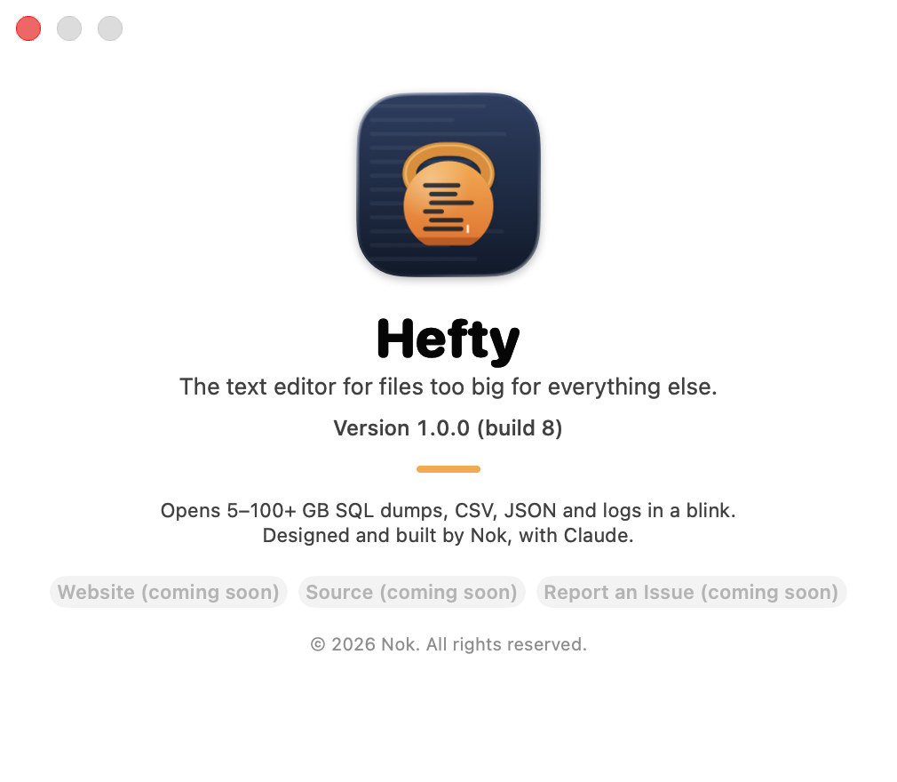

<p align="center"></p>

<h1 align="center">Hefty</h1>

<p align="center"><b>The text editor for files too big for everything else.</b><br>
A free, open-source, native macOS editor for 5–100+ GB SQL dumps, CSV, JSON and logs, in the spirit of EmEditor.</p>

<p align="center">
  <a href="https://github.com/NikhilPanwar/Hefty/releases/latest">Download</a> ·
  <a href="https://nikhilpanwar.github.io/Hefty/">Website</a> ·
  <a href="ARCHITECTURE.md">Architecture</a> ·
  <a href="https://github.com/NikhilPanwar/Hefty/issues">Issues</a>
</p>

<p align="center"></p>

## What it does

- Opens 5–100+ GB text files instantly (memory-mapped, background line indexing, ~250 MB RAM)
- Edits never wait: search, save and formatting run on a snapshot in the background
- Unlimited undo/redo; undo survives saving
- Safe save (temp file + atomic swap), crash-recovery journal, reloads when the file changes, follows growing logs
- Syntax colors for SQL, JSON, CSV/TSV (per column), XML/HTML and logs
- Find/replace with regex, whole word, match case, Find All, Replace All, Filter Lines
- Multiple cursors, column selection, word wrap, split editor, hex view, bookmarks, go to line/percent/byte
- Format/minify JSON, format XML and SQL; CSV sort/filter/copy column
- 25 encodings, LF/CRLF/CR line endings, themes, fonts, Settings (⌘,)

Full list: Help › Keyboard Shortcuts in the app.

## Install (DMG)

1. Download `Hefty-1.0.0.dmg` from [Releases](https://github.com/NikhilPanwar/Hefty/releases/latest)
   (also in this repo at [`release/`](release/)).
2. Open the DMG and drag **Hefty** onto **Applications**.
3. First launch: Hefty is ad-hoc signed, not notarized by Apple, so macOS blocks a plain double-click once.
   Use any one of these:
   - **Right-click Open** (macOS 13–14): in Applications, right-click (or Control-click) Hefty › **Open** › **Open**.
   - **Open Anyway:** double-click Hefty, dismiss the warning, then go to
     System Settings › Privacy & Security, scroll down, click **Open Anyway**, and confirm.
     (On macOS 15 and later this replaces right-click Open.)
   - **Terminal:** clear the download quarantine flag, then open normally:
     ```sh
     xattr -dr com.apple.quarantine /Applications/Hefty.app
     ```
4. Requirements: macOS 13 Ventura or later; Apple Silicon or Intel (universal binary).

Upgrading from BigFileEditor 0.x: settings, recent files and unsaved-work recovery carry over on first launch.

## Build from source

**Requirements**

- macOS 13 or later
- Swift 5.9+ toolchain: either Xcode 15+ or just the Command Line Tools (`xcode-select --install`)
- Check with `swift --version`

**Build and run**

```sh
git clone https://github.com/NikhilPanwar/Hefty.git
cd Hefty
swift build -c release
swift run -c release Hefty                 # opens an Open dialog
swift run -c release Hefty /path/to/huge.sql
```

Or open `Package.swift` in Xcode, pick the **Hefty** scheme and press Run.

**Run the tests**

```sh
scripts/test.sh        # wraps `swift test`; adds the paths Swift Testing needs with Command Line Tools only
```

**Make the .app**

```sh
scripts/make-app.sh             # build/Hefty.app (universal arm64 + x86_64, ad-hoc signed)
scripts/make-app.sh --install   # same, then copies it to ~/Applications
```

**Make the DMG**

```sh
scripts/make-dmg.sh             # build/Hefty-<version>.dmg (styled window) and build/Hefty-<version>.zip
```

- The DMG script drives Finder to lay out the window; allow Terminal to control Finder if asked
  (otherwise it still builds, without the styled layout).
- Version: `VERSION` in `scripts/make-app.sh`. Build number: git commit count.

**Make a big test file** (size in GB)

```sh
scripts/make-test-file.sh ~/Desktop/test.sql 10
```

## Project layout

```
Package.swift                SwiftPM manifest (macOS 13+)
Sources/BigFileCore/         engine, no UI: MappedFile, PieceTable, LineIndex, TextDocument,
                             Search, Syntax, Formatter, Encoding, LineTools, Recovery
Sources/Hefty/               AppKit app: AppDelegate (menus), EditorWindowController, BigTextView
                             (CoreText viewport), HexView, Settings, Theme, AboutWindow, Migration
Tests/BigFileCoreTests/      engine tests (Swift Testing)
scripts/                     make-app, make-dmg, make-icon (draws all icon/DMG art), test, make-test-file
assets/brand/                logo SVG, icon PNGs, Hefty.icns, DMG background, brand sheet (brand.html)
assets/screenshots/          images used in this README
landing-page/                static website (index.html, og-image.png, robots.txt, sitemap.xml, icon)
landing-page/_src/           page source, FAQ, og.html (source of og-image.png share card); build.py regenerates index.html
release/                     Hefty-1.0.0.dmg
.github/workflows/pages.yml  deploys landing-page/ to GitHub Pages
ARCHITECTURE.md              design decisions and how the engine works
```

## Publish the landing page (GitHub Pages)

1. Push this repo to `github.com/NikhilPanwar/Hefty`.
2. In the repo: **Settings › Pages › Build and deployment › Source: GitHub Actions**.
3. The **Landing page** workflow deploys `landing-page/` (without `_src/`) on every push to `main`
   that touches it; run it manually from the Actions tab the first time.
4. Site goes live at https://nikhilpanwar.github.io/Hefty/.
- Different URL or custom domain? Update `URL` in `landing-page/_src/build.py`, run it, and commit.
  For a custom domain also add a `landing-page/CNAME` file and set the domain in Settings › Pages.

## Cut a GitHub Release

The website's Download button links to `releases/latest`, so each release needs the DMG attached.

1. Bump `VERSION` in `scripts/make-app.sh`, commit.
2. Build: `scripts/make-dmg.sh`
3. Tag and push: `git tag v1.0.0 && git push origin v1.0.0`
4. Create the release and upload the DMG, either in the browser (Releases › Draft a new release ›
   choose the tag › attach `build/Hefty-1.0.0.dmg` › Publish) or with the GitHub CLI:
   ```sh
   gh release create v1.0.0 build/Hefty-1.0.0.dmg build/Hefty-1.0.0.zip \
     --title "Hefty 1.0.0" --notes "First open-source release."
   ```
   For 1.0.0 you can upload the prebuilt `release/Hefty-1.0.0.dmg` instead.
5. Optional: copy the new DMG into `release/` (replacing the old one) so the repo copy matches.

## License

[MIT](LICENSE) © 2026 Nok
